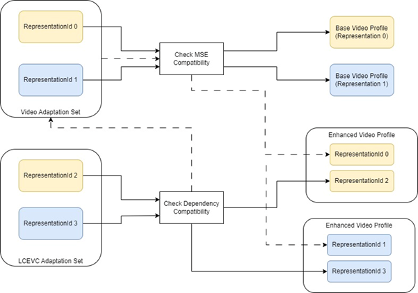
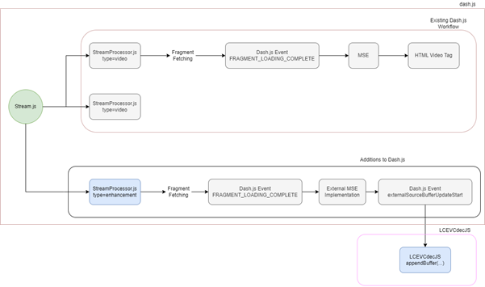

# Scalable LCEVC in dash.js

## Introduction



This approach creates LCEVC representations which are dependent upon native codec representations (by using dependencyId). LCEVC enhancement representations are contained in a 2nd Adaptation Set and linked to the base representations in the 1st Adaptation Set. The outcome is the ability to play adaptive streaming content where one or more higher resolution profiles are generated by applying LCEVC enhancement to existing conventional profiles saving up to 70% bitrate compared to using conventional standalone native profiles.

An external implementation of the MSE classes MediaSource and SourceBuffer is provided to interject the calls from the enhancement representations. The external SourceBuffer implementation triggers events on buffers appended and removed which the external libraries can listen to.



## Sample player

An example player is available at [https://reference.dashif.org/dash.js/nightly/samples/lcevc-dual-track/lcevc-dual-track.html](https://reference.dashif.org/dash.js/nightly/samples/lcevc-dual-track/lcevc-dual-track.html)

## Manifest format

A separate AdaptationSet is added, alongside the backward compatible video AdaptationSet with the base codec Representations, comprising only the LCEVC Representations with dependencyId that corresponds to the associated base representation. 
The AdaptationSet of the dependent representations would have the following attributes: 

 - @contentType = ‘video’ 
 - @mimeType = ‘video/mp4’ 
 - @codecs = ‘lvc1’ 
 - @frameRate = <<frameRate of base representation>> 
 - @dependencyId = <<representationId of base representation>> 
 - @width/height = <LCEVC enhanced video width/height> 
 - @bandwidth = <combined bit rate of the LCEVC + base representation> 
 - @sar = <sample aspect ratio as signalled in LCEVC Video Usability Information (VUI)>

## Example manifest

Sample manifest is available at [https://s3.eu-west-1.amazonaws.com/origin-prod-lon-v-nova.com/lcevcDualTrack/1080p30_3Mbps_no_dR/master.mpd](https://s3.eu-west-1.amazonaws.com/origin-prod-lon-v-nova.com/lcevcDualTrack/1080p30_3Mbps_no_dR/master.mpd)

```
<?xml version="1.0" encoding="utf-8"?>
<MPD
  xmlns:xsi="http://www.w3.org/2001/XMLSchema-instance"
  xmlns="urn:mpeg:dash:schema:mpd:2011"
  xsi:schemaLocation="urn:mpeg:dash:schema:mpd:2011 http://standards.iso.org/ittf/PubliclyAvailableStandards/MPEG-DASH_schema_files/DASH-MPD.xsd"
  type="static"
  mediaPresentationDuration="PT10M34.600S"
  maxSegmentDuration="PT3S"
  minBufferTime="PT10S"
  profiles="urn:mpeg:dash:profile:isoff-live:2011,urn:hbbtv:dash:profile:isoff-live:2012">
  <Period
    id="1"
    duration="PT10M34.600S">
    <BaseURL>dash/</BaseURL>
    <AdaptationSet
      id="1"
      group="1"
      contentType="audio"
      segmentAlignment="true"
      audioSamplingRate="44100"
      mimeType="audio/mp4"
      codecs="mp4a.40.2"
      startWithSAP="1">
      <AudioChannelConfiguration
        schemeIdUri="urn:mpeg:dash:23003:3:audio_channel_configuration:2011"
        value="2" />
      <Role schemeIdUri="urn:mpeg:dash:role:2011" value="main" />
      <SegmentTemplate
        timescale="44100"
        initialization="out-sorted-$RepresentationID$.dash"
        media="out-sorted-$RepresentationID$-$Time$.dash">
        <SegmentTimeline>
          <S t="0" d="9216" />
          ...
          <S d="62221" />
        </SegmentTimeline>
      </SegmentTemplate>
      <Representation
        id="audio=64468"
        bandwidth="64468">
      </Representation>
    </AdaptationSet>
    <AdaptationSet
      id="2"
      group="2"
      contentType="video"
      par="16:9"
      segmentAlignment="true"
      width="960"
      height="540"
      sar="1:1"
      frameRate="30"
      mimeType="video/mp4"
      codecs="avc1.64001F"
      startWithSAP="1">
      <SupplementalProperty
        schemeIdUri="urn:mpeg:dash:adaptation-set-switching:2016"
        value="3" />
      <Role schemeIdUri="urn:mpeg:dash:role:2011" value="main" />
      <SegmentTemplate
        timescale="600"
        initialization="out-sorted-$RepresentationID$.dash"
        media="out-sorted-$RepresentationID$-$Time$.dash">
        <SegmentTimeline>
          <S t="0" d="120" />
          ...
          <S d="1100" />
        </SegmentTimeline>
      </SegmentTemplate>
      <Representation
        id="video=1510172"
        bandwidth="1510172"
        scanType="progressive">
      </Representation>
    </AdaptationSet>
    <AdaptationSet
      id="3"
      group="2"
      contentType="video"
      par="16:9"
      segmentAlignment="true"
      width="1920"
      height="1080"
      sar="1:1"
      mimeType="video/mp4"
      codecs="lvc1"
      startWithSAP="1">
      <SupplementalProperty
        schemeIdUri="urn:mpeg:dash:adaptation-set-switching:2016"
        value="2" />
      <Role schemeIdUri="urn:mpeg:dash:role:2011" value="main" />
      <SegmentTemplate
        timescale="15360"
        initialization="out-sorted-$RepresentationID$.dash"
        media="out-sorted-$RepresentationID$-$Time$.dash">
        <SegmentTimeline>
          <S t="0" d="3072" />
          ...
          <S d="28160" />
        </SegmentTimeline>
      </SegmentTemplate>
      <Representation
        id="video_1=1544000"
        bandwidth="3054172"
        dependencyId="video=1510172"
        frameRate="30"
        mimeType="video/mp4"
        scanType="unknown">
      </Representation>
    </AdaptationSet>
  </Period>
</MPD>
```

## Encoding LCEVC-enhanced content with ffmpeg

Instructions on how to use ffmpeg to encode LCEVC are available here [https://docs.v-nova.com/v-nova/lcevc/reference-applications/ffmpeg](https://docs.v-nova.com/v-nova/lcevc/reference-applications/ffmpeg).

## Example script to generate scalable LCEVC for MPEG-DASH delivery

```
LD_LIBRARY_PATH=./ffmpeg ./ffmpeg/ffmpeg.exe -y -i bbb_sunflower_2160p_30fps_normal.mp4 -c:v lcevc_h264 -base_encoder x264 -strict -2 -acodec aac -ar 44100 -ac 2 -ab 64k -b:v 3000000 -g 60 -separate_track 1 -eil_params "rc_pcrf_base_prop=0.65;encoding_debug_residuals=1" -pix_fmt yuv420p -r 30 -s 1920x1080 out1.mp4 

# Generate .ismv file out of the encodes. 
mp4split -o out-sorted.ismv \ 
    out1.mp4

# Generate .ism manifest from the ismv file. 
mp4split -o out-sorted.ism \ 
    out-sorted.ismv 

# Generate dash files locally  this should generate a manifest.mpd 
mp4split \ 
    --store-mpd \ 
    -o manifest.mpd \ 
    out-sorted.ism 

# Generate Final manifest with addition of dependencyID and supplemental properties 
manifest_edit \ 
    -o finalManifest.mpd \ 
    --python_pipeline_config=/etc/manifest-edit/conf/mpd/default.yaml \ 
    out-sorted.mpd 
```

## Faster representation switching for demo purposes

Enhanced representations, similar to base video representations, are buffered ahead according to default dash.js settings and representation switching is not instant. If faster representation switching is desired for demo purposes, dash.js buffer settings can be adjusted as needed:

```js
const bufferingDuration = 3;

const defaultSettings = {
  streaming: {
    buffer: {
      bufferTimeAtTopQuality: bufferingDuration,
      bufferTimeAtTopQualityLongForm: bufferingDuration,
      bufferTimeDefault: bufferingDuration,
      bufferPruningInterval: bufferingDuration,
      bufferToKeep: bufferingDuration,
    },
    ...
  }
  ...
};

player.updateSettings(defaultSettings);
```
