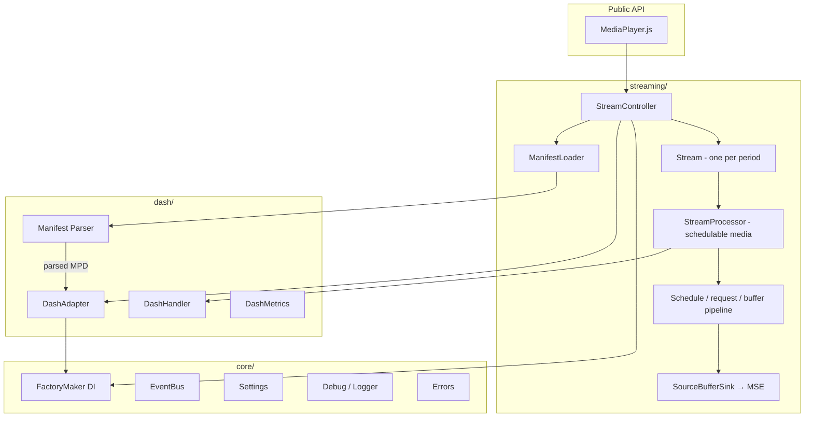

# Architecture

dash.js is organized into conceptual subsystems rather than strict dependency layers. The `streaming/` folder contains
the playback engine and player API, `dash/` contains most MPD-specific logic, and `core/` contains shared
infrastructure. These folders intentionally share some constants, value objects, and utilities. Smooth Streaming
(`mss/`) and offline playback (`offline/`) are optional satellites with their own bundles.

## The layers

- **`core/`** — shared infrastructure: dependency injection ([FactoryMaker](dependency-injection.html)), the
  [EventBus](event-bus.html), `Settings`, `Debug`/logging and the [error definitions](error-model.html).
- **`dash/`** — the MPD world: manifest parsing (`parser/`), `DashAdapter` (the facade the streaming layer uses to
  query the manifest — see [Manifest Handling](manifest-handling.html)), `DashHandler` (segment request generation)
  and `DashMetrics`.
- **`streaming/`** — the playback engine and the player instance API (`MediaPlayer.js`). Contains the
  [playback pipeline](playback-pipeline.html), the controllers, the ABR rules
  (see [Adaptive Bitrate Streaming](../../usage/abr/index.html)), the EME/DRM stack (`protection/`) and the HTTP
  loading stack (`net/`).
- **`mss/`** — Microsoft Smooth Streaming support, shipped as a separate bundle (`dash.mss.min.js`).
- **`offline/`** — offline download and playback.

## Data flow at a glance

1. The application calls `player.initialize(video, url, autoPlay)`.
2. The manifest is loaded and parsed. `DashAdapter` translates it for most playback queries, while dedicated manifest
   lifecycle, filtering, and BaseURL modules also operate on the parsed tree.
3. `StreamController` creates one `Stream` per period. The active `Stream` creates processors for schedulable media;
   images and embedded text use dedicated paths, while enhancement media can add another `StreamProcessor`.
4. Each `StreamProcessor` runs a schedule/load/append loop: `DashHandler` generates segment requests, the `net/` stack
   loads them, `SourceBufferSink` appends them to the Media Source Extensions buffers.
5. Metrics from every step feed the ABR rules, which adjust the selected Representation continuously.

## Entry points

Two JavaScript files aggregate the root APIs; they are not the complete list of webpack entries or package exports:

- **`index.js`** (`dash.all.min.js`) — extends the player entry with DRM (`Protection`), metrics reporting,
  `MediaPlayerFactory`, public constants/helpers, and `ExternalSubtitle`. MSS and offline remain separate bundles.
- **`index_mediaplayerOnly.js`** (`dash.mediaplayer.min.js`) — exposes `MediaPlayer`, `FactoryMaker`, `Debug`, and
  version information. The player still contains text playback; protection and metrics reporting are excluded.

The authoritative production and development bundle lists are in
`build/webpack/common/webpack.common.base.cjs`; published package subpaths are in `package.json`.

The following pages describe the individual building blocks in detail:

- [Dependency Injection](dependency-injection.html) - the FactoryMaker pattern and per-player contexts
- [Event Bus & Wiring](event-bus.html) - how modules communicate
- [Playback Pipeline](playback-pipeline.html) - from schedule decision to appended segment
- [Manifest Handling](manifest-handling.html) - loading, parsing and the DashAdapter facade
- [Error Model](error-model.html) - error events vs. synchronous throws
