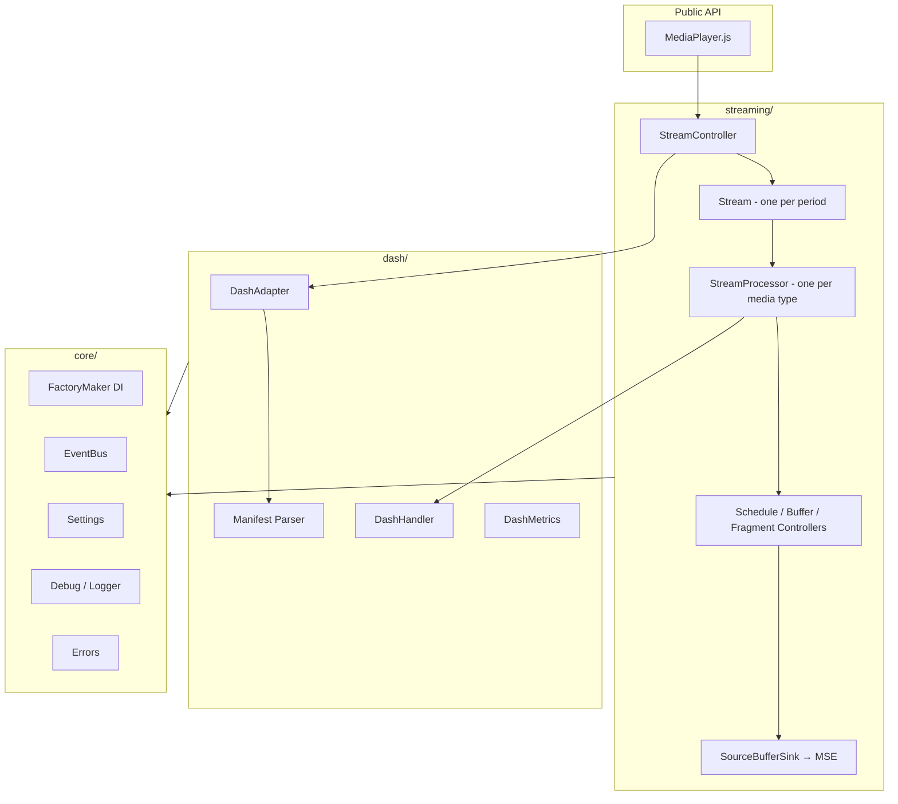

# Architecture

dash.js is organized in layers with a strict direction of dependencies: the `streaming/` layer implements the playback
engine and the public API, the `dash/` layer encapsulates everything MPD-related, and the `core/` layer provides the
infrastructure both build on. Smooth Streaming (`mss/`) and offline playback (`offline/`) are optional satellites with
their own bundles.

## The layers

- **`core/`** — dependency injection ([FactoryMaker](dependency-injection.html)), the [EventBus](event-bus.html),
  `Settings`, `Debug`/logging and the [error definitions](error-model.html). No media logic.
- **`dash/`** — the MPD world: manifest parsing (`parser/`), `DashAdapter` (the facade the streaming layer uses to
  query the manifest — see [Manifest Handling](manifest-handling.html)), `DashHandler` (segment request generation)
  and `DashMetrics`.
- **`streaming/`** — the playback engine and the entire public API surface (`MediaPlayer.js`). Contains the
  [playback pipeline](playback-pipeline.html), the controllers, the ABR rules
  (see [Adaptive Bitrate Streaming](../../usage/abr/index.html)), the EME/DRM stack (`protection/`) and the HTTP
  loading stack (`net/`).
- **`mss/`** — Microsoft Smooth Streaming support, shipped as a separate bundle (`dash.mss.min.js`).
- **`offline/`** — offline download and playback.

## Data flow at a glance

1. The application calls `player.initialize(video, url, autoPlay)`.
2. The manifest is loaded and parsed; the streaming layer queries it exclusively through `DashAdapter`.
3. `StreamController` creates one `Stream` per period; the active `Stream` creates one `StreamProcessor` per media
   type (video, audio, text).
4. Each `StreamProcessor` runs a schedule/load/append loop: `DashHandler` generates segment requests, the `net/` stack
   loads them, `SourceBufferSink` appends them to the Media Source Extensions buffers.
5. Metrics from every step feed the ABR rules, which adjust the selected Representation continuously.

## Entry points

dash.js ships two entry points:

- **`index.js`** (full build, `dash.all.min.js`) — everything: DRM (`Protection`), metrics reporting, text/subtitle
  support, `MediaPlayerFactory` for declarative setup.
- **`index_mediaplayerOnly.js`** (`dash.mediaplayer.min.js`) — the lightweight core: `MediaPlayer`, `FactoryMaker`
  and version info only. DRM, offline and text modules can be added at runtime as needed.

The following pages describe the individual building blocks in detail:

- [Dependency Injection](dependency-injection.html) - the FactoryMaker pattern and per-player contexts
- [Event Bus & Wiring](event-bus.html) - how modules communicate
- [Playback Pipeline](playback-pipeline.html) - from schedule decision to appended segment
- [Manifest Handling](manifest-handling.html) - loading, parsing and the DashAdapter facade
- [Error Model](error-model.html) - error events vs. synchronous throws
