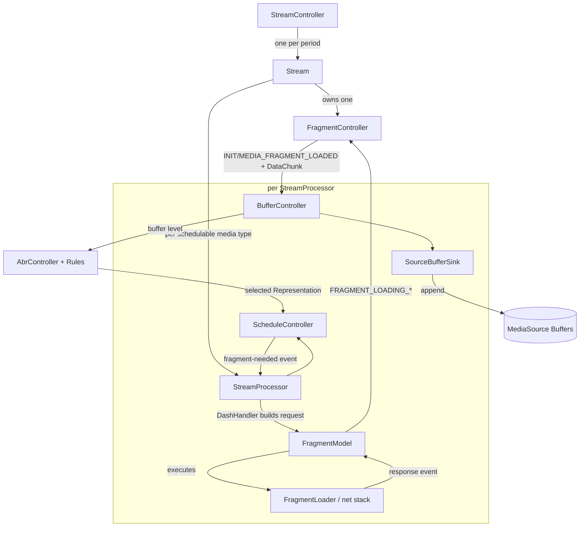

# Playback Pipeline

The playback pipeline turns a parsed manifest into appended media segments. It is a hierarchy of controllers, each
with a single responsibility.

## The hierarchy

- **`StreamController`** — owns the set of `Stream` objects (one per DASH period), performs period transitions and
  stream switching, decides which stream is active. See [Multiperiod Streams](../../usage/multiperiod.html).
- **`Stream`** — represents one period. Creates one `FragmentController` and manages the processors/controllers for
  its media. Images use `ThumbnailController`, embedded text is handed directly to `TextController`, and enhancement
  media can add a second processor alongside its base video.
- **`StreamProcessor`** — the workhorse for each schedulable audio, video, or fragmented-text path. Owns the
  schedule/load/append loop and the associated controllers.

## The schedule → load → append loop

For each media type the loop runs continuously:

1. **`ScheduleController`** decides *whether and when* the next segment should be requested — based on the buffer
   target levels, the playback state and whether a quality/track switch is pending.
2. **`StreamProcessor`** handles that signal, asks **`DashHandler`** for the concrete `FragmentRequest`, then gives the
   request to its per-media-type **`FragmentModel`**.
3. **`FragmentModel`** tracks request state and delegates the download to **`FragmentLoader`** and the HTTP stack
   (`streaming/net/`), where request interceptors, CMCD reporting and retry handling are applied.
   See [Network Interceptor](../../usage/network-interceptor.html).
4. **`FragmentController`** converts loading responses into `DataChunk` events. **`BufferController`** consumes those
   chunks, tracks buffer levels and pruning, and hands them to **`SourceBufferSink`**, which appends them to the Media
   Source Extensions `SourceBuffer`.
5. Metrics collected along the way (throughput, buffer level, dropped frames) feed **`AbrController`** and its
   [rules](../../usage/abr/index.html), whose decisions flow back into the next scheduling iteration.

## Supporting controllers

- **`PlaybackController`** — wraps the video element: play/pause/seek, live delay, playback rate.
- **`MediaSourceController`** — creates and manages the `MediaSource` object and its lifecycle.
- **`GapController`** — detects and jumps buffer gaps to prevent stalls.
- **`CatchupController`** — low-latency catchup: adjusts playback rate to hold the live delay target.
  See [Low Latency Streaming](../../usage/low-latency.html).
- **`TimeSyncController`** — client/server clock synchronization for live streams.
  See [Clock Synchronization](../../usage/clock-sync.html).
